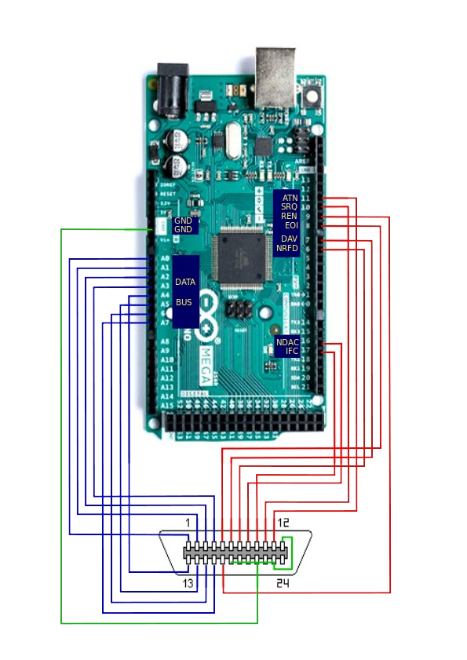
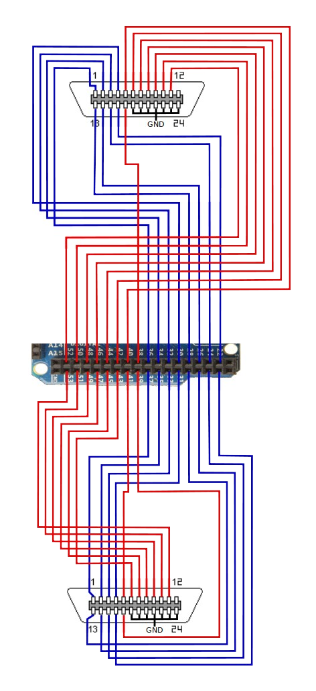

===================
 Arduino Mega 2560
===================

Connection
==========

These connections are required between the Arduino Mega 2560 and the IEEE488 connector:

======= ================= ========
Arduino GPIB connector    Function
======= ================= ========
A0      1                 DIO1
A1      2                 DIO2
A2      3                 DIO3
A3      4                 DIO4
D8      5                 EOI
D7      6                 DAV
D6      7                 NRFD
D16     8                 NDAC
D17     9                 IFC
D10     10                SRQ
D11     11                ATN
GND     12                Shield
A4      13                DIO5
A5      14                DIO6
A6      15                DIO7
A7      16                DIO8
D9      17                REN
GND     18,19,20,21,22,23 GND
======= ================= ========

The layout on the Mega was chosen so as to leave pins ``A8-A15`` and the two rows of
pins at the top of the board free for expansion including for displays and other
peripherals.

Pins 16 and 17 correspond to ``Serial2``. As these have been used for controlling
signals on the GPIB bus, they cannot be used for serial communication. If
``Serial2.begin`` is added to the sketch, these pins will be enabled for serial
communication and will no longer function as GPIB control signals. In addition to the
default serial port (``RX0`` and ``TX0``), ``Serial1`` and ``Serial3`` are still
available for expansion if required. These two pins were chosen for GPIB signals as they
belong to port H along with pins 6 – 9.

Wiring diagram - default layout
-------------------------------

Wiring diagram - layout E1 & E2
-------------------------------

   Arduino Mega 2560 wiring diagram

.. figure:: ../_static/wiring_mega_e1e2_pinout.png
   :alt: Arduino Mega 2560 E1/E2 pinout

   Arduino Mega 2560 E1/E2 pinout
