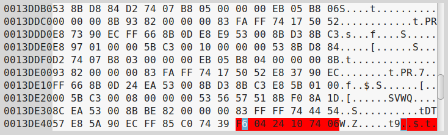
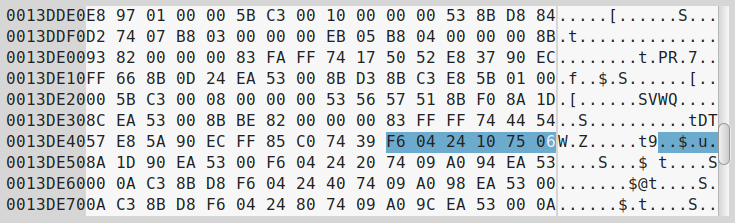
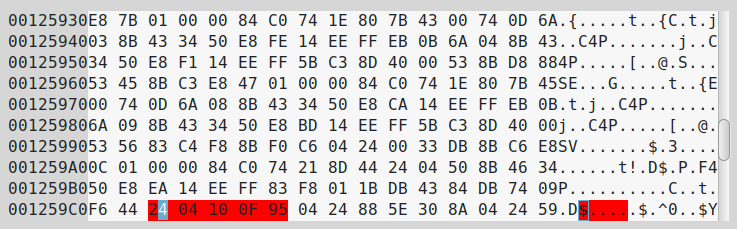
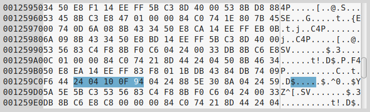

===============================
 Working with EZGPIB and KE5FX
===============================

FTDI serial vs CH340G serial
============================

EZGPIB is an IDE programming environment that can be used to work with GPIB devices.
`KE5FX <http://www.ke5fx.com/gpib/readme.htm>`_ provides testing tools that can be used
with various instruments that support GPIB. Both programs support the Prologix interface
and when communicating with it, both programs assert ``RTS`` and expect a ``CTS``
response to confirm that the interface is ready to accept data.

The `CH340G <www.wch-ic.com/products/CH340.html>`_ chipset present in many Arduino
compatible boards does not respond with the ``CTS`` signal. There appear to be two
possible workarounds, one of which requires very good soldering skills. The ``RTS`` and
``CTS`` signals are exposed via pins 14 and 9 respectively on the CH340G chip. While pin
9 connects to an easily accessible pad for soldering, pin 14 is not connected to
anywhere and because it is very small, attaching a wire to it is rather tricky. For this
reason, workaround 2 is easier to implement.

.. admonition:: Disclaimer

   please proceed only if you are confident in your soldering skills. I take no
   responsibility for damaged Arduino boards so if in doubt, ask a qualified or skilled
   person for assistance.

Workaround 1
------------

The workaround requires that pin 14 be connected to pin 9 on the CH340G chip. When
``RTS`` is asserted by the host over USB, the signal is passed to the ``RTS`` output on
pin 14 of the CH340G. This signal would ordinarily be passed to a serial hardware device
which would respond by sending a response to the ``CTS`` input on pin 9 of the the
CH340G to indicate that it is ready to send. The workaround passes this signal back to
the ``CTS`` input via the link so that a ``CTS`` response will always be echoed back to
the host over USB. While this does not provide proper ``RTS/CTS`` handshaking, it does
allow the interface to respond with a ``CTS`` signal and, in turn, the host to be able
to accept responses to the commands sent to the interface, even when ``RTS/CTS``
handshaking is used.

Workaround 2
------------

Pin 9 of the CH340G needs to be connected to ``GND``. This will keep ``CTS`` signal
asserted on the Arduino at all times, so again, proper handshaking is not provided.
Simply solder a short wire to the pad and connect to a convenient ground point.

A big thanks goes to Hartmut Päsler, who is currently looking after the EZGPIB program,
for informing me that the CH340G exposes the ``RTS/CTS`` signals via pins and that it
might be possible to make use of these pins to devise a solution.

Where Arduino boards are recognized as FTDI serial devices, the functionality is
embedded within the ATMEGA MEGA 16U2 chip. This chip does not expose the ``RTS/CTS``
signals so this modification is not possible nor is it required to work with the KE5FX
toolkit. An Arduino board running with the 16U2 chip running AR488 will work fine with
the KE5FX GPIB toolkit, but for some reason, it is not recognized by the EZGPIB program.

EZGPIB and the Arduino bootloader
=================================

On older Arduino boards it was necessary to press the reset button to program the board.
This causes the board to reset and the bootloader to run. The bootloader will expect a
particular sequence of bytes within a timeout period and it will then expect a new
compiled sketch to be uploaded into memory. On completion of the upload, program control
is passed to the newly uploaded code. The timing of the upload is rather tricky and if
the timeout period expires or the upload is started too soon, then it will fail and the
board will start with the current program code.

Current versions of the board allow code to be uploaded via USB without having to use
the reset button. This is accomplished by triggering a reset of the board each time a
serial connection is opened. The bootloader is then re-loaded and if the required
sequence of bytes is received, and an upload of code proceeds automatically. When this
is finished, program execution passes to the new code as before.

The problem with this is that the bootloader is loaded every time that the serial port
is opened. This causes a delay of about 1 second before the compiled user program is
actually run and the interface is initialised. EZGPIB (and possibly other programs) that
do not re-try the connection attempt after waiting a second or so, fails to establish a
connection to the interface. Closing the program and immediately trying again usually
results in a successful connection.

The solution is to eliminate the delay caused by the board re-starting and the
bootloader being re- loaded into memory. This can be done quite easily by placing a 10μF
capacitor between the RST F capacitor between the RST and GND pins on the Arduino. This
causes the reset pulse, which is generated by activating the serial DTR signal, to be
drained to ground without affecting the RESET input on the AtMega328P processor. Since
it’s a capacitor, there is no direct DC coupling between RESET and GND. When the serial
port is now opened, the interface will just respond without the delay caused by
re-booting. Assuming the sequence “GPIB-USB” exists in the response to the ++ver
command, EZGPIB will now recognize it first time.

The drawback of this approach is that placing a capacitor permanently in this position
will prevent the Arduino IDE from being able to program the board. The reset button now
has to be used or a switch added to provide an on to run, off to program facility.

Hacking the Ezgpib binary
-------------------------

If you are familiar with using a hex editor, there is another approach that involves
editing the EZGPIB.EXE binary to prevent it looking for an RTS signal being asserted. If
the standard Windows USBSER.SYS driver is used, this never happens, so EZGPIB will never
find the GPIB adapter. This workaround involves changing a specific byte in the RTS
Check routine.

Open up a copy of EXGPIB.EXE version 20121217 in a hex editor. Look for the HEX
sequence::

  F6 04 24 10 74 06

Note that these instructions can also be found on http://www.dalton.ax/gpib/, but show
the sequence as ``F6 02 24 10 74 06``. I found the sequence to be as above. I’m not sure
whether this is an error or because my binary is different from the one that the author
was working with. If you can’t find the sequence with ``04`` , check for the one with
``02``.

That sequence is the check for ``RTS``. Change the penultimate byte to ``75``, so that
the sequence now reads::

  F6 04 24 10 75 06

Now look for sequence::

  24 04 10 0F 95

Change the last byte to ``94`` so that the sequence now reads::

  24 04 10 0F 94

save the file and close the hex editor. EZGPIB should now find your adapter.
